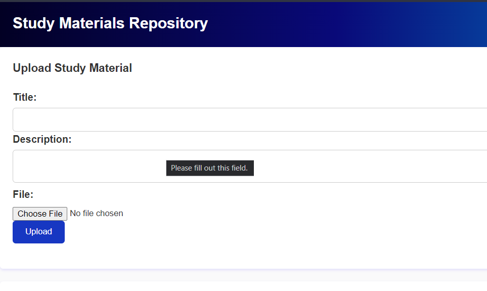

# Study Material Repository

A simple web-based study material repository where users can upload and download study materials.



## Features

- User Registration and Login: Users can create an account and log in to the system.
- Upload Study Materials: Users can upload study materials such as documents, presentations, and images.
- Download Study Materials: Users can browse and download study materials uploaded by others.
- Search Functionality: Users can search for specific study materials based on keywords or categories.
- User Profiles: Users have personalized profiles where they can view and manage their uploaded materials.
- Edit and Delete: Users can edit or delete their own uploaded materials.

## Getting Started

1. Install dependencies by running `npm install`.
2. Set up the database by executing the SQL scripts provided in the `database` folder.
3. Configure the database connection in the `config.js` file.
4. Start the server by running `npm start` or `node app.js`.
5. Access the application by navigating to `http://localhost:5000` in your web browser.

## Technologies Used

- Node.js
- Python
- MySQL
- Handlebars (Template Engine)
- HTML,CSS (Front-end Framework)

## Screenshots

### Main Page


### Uploaded Successfully 


### Uploaded File


## Contributing

Contributions are welcome! If you have any ideas, improvements, or bug fixes, please open an issue or submit a pull request.

## License

This project is licensed under the [MIT License](LICENSE).

---

**README.md - Command Prompt Application**

A command prompt application for managing and organizing study materials.


## Features

- Add Study Materials: Users can add study materials to the repository.
- Edit Study Materials: Users can edit the details of existing study materials.
- Delete Study Materials: Users can delete unwanted study materials from the repository.
- Search Functionality: Users can search for specific study materials based on keywords or categories.

## Getting Started

1. Clone the repository to your local machine.
2. Open the command prompt or terminal and navigate to the project directory.
3. Run the application using the provided command-line interface (CLI) commands.

## Usage

- To add a start th project:
  ```
  cd  <file-path>
  ```

- To start the environment:
  ```
  python -m venv env
  ```

- To start the flask application:
  ```
  .\env\Scripts\Activate.bat
  ```

- To run the application:
  ```
  python app.py
  ```
- Go to the port number :
  ---
  http://127.0.0.1:5000
  ---
  


## Contributing

Contributions are welcome! If you have any ideas, improvements, or bug fixes, please open an issue or submit a pull request.

## License

This project is licensed under the [MIT License](LICENSE).

---

Feel free to customize the README.md files to match your project's structure, add relevant information, and update the paths of the screenshots according to your file structure.

Make sure to save the README.md file and commit it to your repository along with the image files.

Let me know if you need any further assistance!
